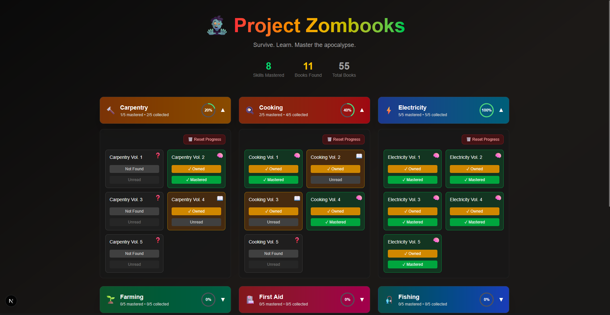

<h1 align="center">🧟‍♂️ Project Zombooks</h1>

<p align="center">
  <strong>Project Zombooks</strong> is a lightweight web app that helps you keep track of which books you've collected and read during your run in <em>Project Zomboid</em>. Never lose track of your survivor's skills again!
</p>

<p align="center">
  <a href="https://project-zombooks.vercel.app"><strong>Live Demo 🚀</strong></a>
</p>

<p align="center">
  
</p>

## 📚 What is Zombooks?

**Zombooks** is a simple, focused companion tool for *Project Zomboid* players. It lets you mark books as *owned* and *mastered*, helping you manage your skill-learning progress throughout the game.

Whether you’re scavenging for survival or preparing for the long winter, Zombooks helps you stay sharp and organized — without the hassle of pen and paper.

---

## ✨ Features

- ✅ **Track your progress**: Mark books by category and volumes.
- 💾 **Saved automatically**: Your data is stored locally via `localStorage`.
- 🔄 **Reset easily**: Clear all your progress with one click.
- 📱 **Responsive design**: Mobile-friendly and optimized for all screen sizes.
- ⚡ **Fast & serverless**: Built with performance in mind and deployed via Vercel.

---

## 🛠️ Tech Stack

This project was built using:

- ⚙️ [Next.js](https://nextjs.org/) – App directory, routing, and server-side rendering
- ⚛️ [React](https://reactjs.org/) – UI components
- 🟦 [TypeScript](https://www.typescriptlang.org/) – Type-safe development
- 🎨 [Tailwind CSS](https://tailwindcss.com/) – Utility-first styling

---

## 🚀 Deployment

This is the **first version** of the project and is deployed via Vercel:

👉 **[project-zombooks.vercel.app](https://project-zombooks.vercel.app)**

Try it out, mark your progress, and survive the apocalypse like a true bookworm.

---

## 🤝 Support

If you like this tool and want to support its development, consider tipping on Ko-fi! Every bit of support helps me keep this open source project alive:

☕ [https://ko-fi.com/ferupin](https://ko-fi.com/ferupin)

Thanks for fueling more late-night code sessions 💗

---

## 👥 Contributing

**Project Zombooks is open source**, and you're invited to be part of it!

If this tool has helped you, or if you're interested in improving it, your contributions are more than welcome. Whether it’s:

- 🐛 Bug reports
- 💡 Feature suggestions
- 🧱 Code improvements
- 🎨 UI/UX feedback

Feel free to fork the repo, open an issue, or submit a pull request.

> New to open source? No problem! I'm happy to help guide you through your first contribution.

---

## 📌 Roadmap

- [ ] Filter by skill category
- [ ] Export/import local progress
- [ ] Light/dark mode toggle
- [ ] Cloud sync (optional login)
- [ ] Multilingual support (EN, PT-BR, etc.)

---

## 🧠 Inspiration

Built for *Project Zomboid* fans who love tracking every bit of progress and hate spreadsheets. Simple. Functional. Apocalypse-ready.

---

## 🛠️ Running Locally

```bash
# Clone the repository
git clone https://github.com/ferupin/project-zombooks.git
cd project-zombooks

# Install dependencies
npm install

# Run the development server
npm run dev
